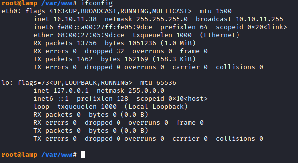
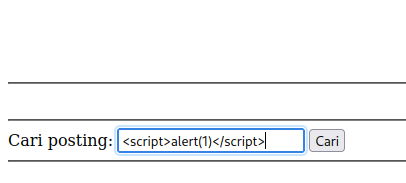
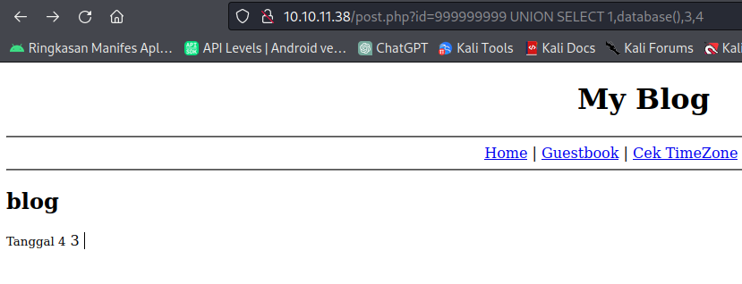
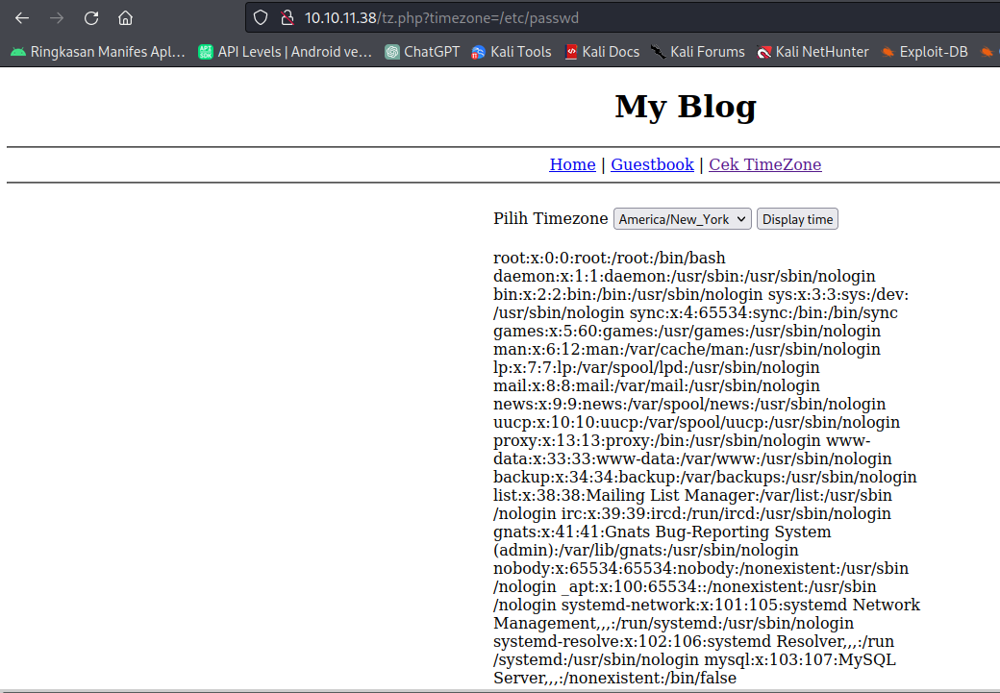

# WEB PENTEST

## Installation
- [Download bahan](https://drive.google.com/file/d/1w87kjStCCnxaGT2UDMX_NaiYMaVGX69x/view?usp=sharing)
- Jalankan vm seperti biasa
- username `root` dan passwordnya `P@ssw0rd`
- jalankan perintah `ifconfig`



- eth0 -> inet `10.10.11.38` ini adalah ip local kalian setiap orang pasti akan berbeda beda

- Lalu kunjungi ip tersebut via browser andalan kalian

## Cross-Site Scripting (XSS)
- Pada halaman Home Terdapat inputan pencarian, Biasanya inputan pencarian sering terdapat bug XSS


- Kita akan mencoba menggunakan payload sederhana
```js
<scripe>alert(1)</script>
```


- Lalu enter dan lihat apa yang terjadi, Boom website ini terdapat celah XSS 

### Bug

- Lihat url ini


- Terdapat query string dengan key `q`

- buka file search.php

```php
...
4 $q = $_GET['q'];
...

...
27 <h3>Hasil pencarian untuk "<?= $q; ?>"</h3>
...
```
- Query di tampung dalam variable $q dan lihat code di baris 27, variable $q di display secara langsung. Penulisan code seperti ini yang membyuka celah XSS

### Fixing

- buka file search_secure.php

```php
...
27 <h3>Hasil pencarian untuk "<?= htmlspecialchars($q); ?>"</h3>
...
```

- Pada baris ke 27 kita akan menambahkan fungsi `htmlspecialchars` untuk memfilter karakter untuk mencegah bug xss

## SQL Injection (SQLi)


- Di halaman Detail post sesuai gambar diatas kita analisis urlnya seperti ini `post.php?id=1`, artinya menampilkan data post yang ber id 1,
sekarang kita akan mengetest url ini apakan vuln terhadap sqli atau tidak dengan cara menambahkan kutip (`'`) di ahir url, sehingga menjadi seperti ini `post.php?id=1'`


- Dan boom..., website pun error, ini artinya website ini terdapat celah sql injection
- Sekarang kita coba menggunakan payload seperti ini `post.php?id=999999999 UNION SELECT 1,2` dan naikkan angkanya sampai website tidak error, Saya memcoba sampai 4 nomer website tidak error `post.php?id=999999999 UNION SELECT 1,2,3,4`, ini artinya table ini terdapat 4 colum, dengan memodifikasi payload kita bisa mengambil data yang kita inginkan, misalnya kita ingin mengambil nama database nya, sehingga kita bisa menggunakan payload seperti ini `post.php?id=999999999 UNION SELECT 1,database(),3,4`

- Hasilnya website ini nama database adalah blog



### Bug

```php
...
7 $id = $_GET['id'];
8 $q  = mysqli_query($conn, "SELECT * FROM posts WHERE id = {$id}") or die(mysqli_error($conn));
9 $post = mysqli_fetch_array($q);
...
```
### Fixing
```php
...
4 $id = $_GET['id'];
5 $stmt = mysqli_prepare($conn, "SELECT * FROM posts WHERE id =?");
6 mysqli_stmt_bind_param($stmt, "s", $id);
7 mysqli_stmt_execute($stmt);
8 $result = mysqli_stmt_get_result($stmt);
9 $post = mysqli_fetch_array($result);
10 mysqli_stmt_close($stmt);
11 mysqli_close($conn);
...
```
## Cross-Site Request Forgery (CSRF) and Cross-Site Script Inclusion (XSSI)


## Authentication and Authorization Bypass


## Security Misconfigurations and Server-Side Request Forgery (SSRF)


## File Inclusion Vulnerabilities


- Url ini `tz.php?timezone=indonesia.php` menampilkan file dari file `indonesia.php` dan kita akan memodifikasi url untuk menampilkan file yang lain dari lokal server `tz.php?timezone=/etc/passwd` dan lihat hasilnya guys, vuln terhadap lfi


